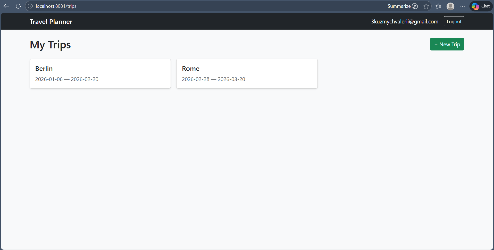
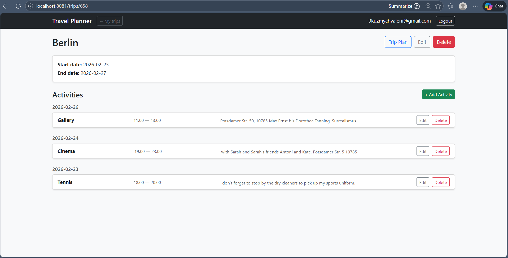
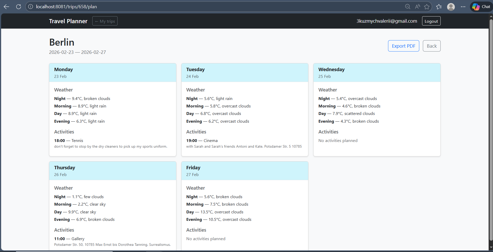
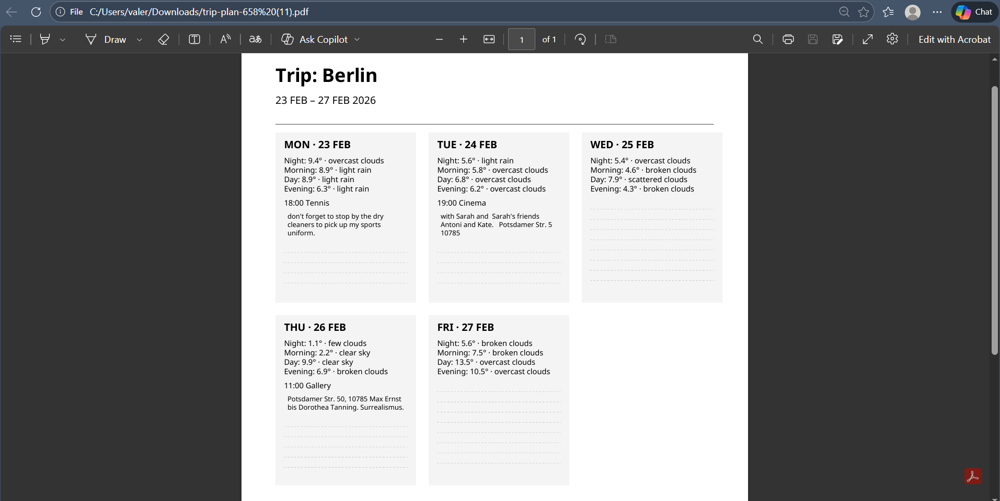

Travel Planner
=

Full-stack travel planning application built with Spring Boot.
Allows authenticated users to manage trips, plan daily activities, view weather forecast, and export a trip plan to PDF.

## Screenshots

### Trips

### Trip Details

### Trip Plan

### PDF Export

Features
-
User registration & authentication (Spring Security)  
Personal trip management  
Activities scheduling per trip  
Weather forecast integration (OpenWeather API)  
Automatic grouping of forecast by day and time period  
Trip plan generation (aggregated weather + activities)  
PDF export of trip plan (Apache PDFBox)  
REST API + Server-side rendered UI (Thymeleaf)  
Flyway database migrations  
PostgreSQL persistence

Architecture Overview
-

+ The application follows a layered architecture:

controller (API + UI) ->
service (business logic) ->
repository (Spring Data JPA) ->
PostgreSQL

+ Layers

controller.api – REST endpoints  
controller.ui – Thymeleaf-based UI  
service – transactional business logic  
repository – JPA data access  
entity – domain model  
dto – API/UI data transfer objects  
validator – ownership validation logic  
config.security – Spring Security configuration  
db/migration – Flyway SQL migrations

Tech Stack
-
Java 21  
Spring Boot 3.4  
Spring Data JPA  
Spring Security  
Thymeleaf  
PostgreSQL  
Flyway  
Apache PDFBox  
RestTemplate (OpenWeather API)  
Maven

Security
-
Form login  
HTTP Basic support for API usage  
Role-based authentication  
BCrypt password encoding  
Per-resource ownership validation (OwnershipValidator)  
AccessDeniedException handling  
Custom AuthenticationEntryPoint for API vs UI responses

Weather Integration
-

+ The application integrates with OpenWeather:

Geocoding API  
5-day forecast API  
Timezone-aware date conversion

+ Aggregation into:

Morning  
Afternoon  
Evening  
Night

+ Forecast is automatically filtered by:

trip start/end date  
current date in destination timezone  
API forecast limitations

PDF Export
-

+ Trip plans can be exported as PDF:

Custom A4 layout  
Multi-column daily cards  
Weather + activities display  
Dynamic text wrapping  
Embedded fonts (NotoSans)  
Automatic page splitting  
Implemented using Apache PDFBox.

Database
-
Database: PostgreSQL

Flyway manages schema versioning.

JPA settings:

spring.jpa.hibernate.ddl-auto=validate

Schema is migration-driven (no auto DDL generation).

Configuration
-
Required Environment Variables

DB_USER=your_db_user  
DB_PASSWORD=your_db_password  
OPENWEATHER_API_KEY=your_api_key

application.properties
-

spring.datasource.url=jdbc:postgresql://localhost:5433/travel_planner  
server.port=8081

Running the Application
-

Start PostgreSQL

Ensure database exists: travel_planner

Run  
mvn clean install  
mvn spring-boot:run

Application runs on:
http://localhost:8081

REST API Endpoints
-

Authentication required for all endpoints except /auth/**

+ Authentication

| Method | Endpoint             | Description       |
|--------|----------------------|-------------------|  
| POST   | `/auth/login`        | Authenticate user |  
| POST   | `/auth/registration` | Register new user |

+ Trips

Base path: /api/trips

| Method | Endpoint                   | Description           |
|--------|----------------------------|-----------------------|  
| POST   | `/api/trips`               | Create new trip       |  
| GET    | `/api/trips/{id}`          | Get trip by id        |  
| GET    | `/api/trips/user/{userId}` | Get all trips of user |  
| PUT    | `/api/trips/{id}`          | Update trip           |  
| DELETE | `/api/trips/{id}`          | Delete trip           |

+ Activities

Base path: /api/activities

| Method | Endpoint                        | Description             |  
|--------|---------------------------------|-------------------------|  
| POST   | `/api/activities`               | Create activity         |  
| GET    | `/api/activities/{id}`          | Get activity by id      |  
| GET    | `/api/activities/trip/{tripId}` | Get activities for trip |

+ Trip Plan (Weather + Activities Aggregation)

| Method | Endpoint               | Description              |  
|--------|------------------------|--------------------------|  
| GET    | `/api/trips/{id}/plan` | Get aggregated trip plan |

+ PDF Export

| Method | Endpoint               | Description               |  
|--------|------------------------|---------------------------|  
| GET    | `/trips/{id}/plan/pdf` | Download trip plan as PDF |

Web Interface (Thymeleaf UI)
-
Accessible after login at: http://localhost:8081  
Authentication required for all pages except login and registration.

+ Authentication Pages

| Route       | Description       |
|-------------|-------------------|
| `/login`    | Login page        |
| `/register` | User registration |

+ Trips

| Route                  | Description               |
|------------------------|---------------------------|
| `/trips`               | List user trips           |
| `/trips/create`        | Create trip form          |
| `/trips/{id}`          | Trip details              |
| `/trips/{id}/edit`     | Edit trip                 |
| `/trips/{id}/plan`     | View trip plan            |
| `/trips/{id}/plan/pdf` | Download trip plan as PDF |

+ Activities (within trip)

| Route                                  | Description     |
|----------------------------------------|-----------------|
| `/trips/{tripId}/activities`           | List activities |
| `/trips/{tripId}/activities/create`    | Create activity |
| `/trips/{tripId}/activities/{id}/edit` | Edit activity   |

Design Decisions
-

DTO separation from entities (no JSON annotations in entities)   
Class-level @Transactional in service layer  
Ownership validation centralized in service layer  
Forecast data normalized before mapping  
No bidirectional JSON serialization  
Explicit exception handling

Testing
-

Spring Boot Test  
Spring Security Test  
Service layer coverage  
Controller tests

Project Structure
-

config.security  
controller.api  
controller.ui  
dto  
entity  
exception  
repository  
service    
├─ activity  
├─ pdf  
├─ planner  
├─ trip  
├─ user  
├─ validator  
├─ weather  
resources  
├─ db/migration  
├─ templates  
└─ fonts

Possible Improvements
-
Add method-level @PreAuthorize
Add Docker support  
Add Swagger / OpenAPI  
Introduce MapStruct  
Pagination for trip list  
Caching weather responses  

